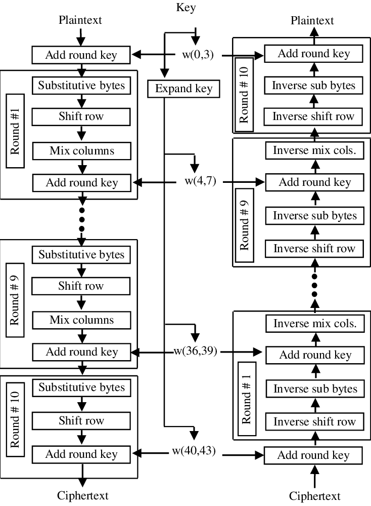
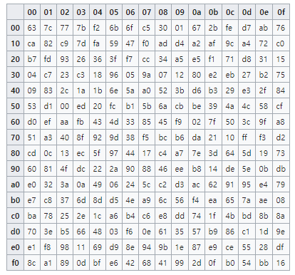

근래 어떤 서비스를 구현하는 과정에서 요청의 유효성을 판단할 용도인 키의 처리를 위해 암호화를 고민하게 되었다. 그래서 이번 글에서는 암호화 알고리즘 적용 과정에서 나왔던 질문에 대한 내 나름대로의 정리를 남겨보고자 한다.


## 1. 암호화? 암호화 알고리즘?

암호화를 한마디로 정의하자면 "수학적인 과정을 통해 정보를 가진 문자열을 의미 없는 문자열로 바꾸는 것" 정도라고 생각한다.

암호화 알고리즘을 설계할 때 confusion과 diffusion의 성질을 이용한다. 이 성질들을 얻기 위해 substituion과 permutation이 사용되며, 이들을 적절히 조합하여 round를 만들고 구성된 round들을 반복하는 방식으로 암호화가 이루어진다. 

Confusion과 diffusion에 대해서 간단하게 설명하면..
- 통계 및 암호화 분석 방법으로 암호를 분석하기 어렵게 방해하는 성질들
    - 따라서 생성된 값의 역상관관계(decorrelation)가 중요한 해쉬 함수나 의사 난수 생성기의 설계 등에서 중요하게 생각되어야 함.
    - 복잡성은 잘 정의되고 반복된 일련의 substition과 permutation을 통해 구현됨
- Confusion (혼돈): 암호문과 키 사이의 관계를 가능한 복잡하게 만드는 것
    - 암호문의 각 binary digit(bit)이 키의 여러 부분에 의존성을 가져야 함. 
- Diffusion(확산): 암호문에 대한 평문의 통계적 구조를 소멸시키는 것.
    - 평문의 1 bit를 바꾸면 통계적으로 절반의 암호문 bit가 바뀌어야 함.
        - 암호문의 1 bit를 바꾸어도 통계적으로 절반의 평문 bit도 바뀌어야 함.
        - bit는 두 가지 성질만 가질 수 있으니 bit가 임의의 한 위치에서 다른 위치로 바뀌었을 때 절반의 bit의 상태가 변경되어야 함.
    - 평문을 행과 열에 분산시켜 중복성을 증가시킴.


## 2. Hash

> 해시 함수(hash function)는 임의의 길이의 데이터를 고정된 길이의 데이터로 매핑하는 함수이다. 해시 함수에 의해 얻어지는 값은 해시 값, 해시 코드, 해시 체크섬 
또는 간단하게 해시라고 한다. 

https://ko.wikipedia.org/wiki/%ED%95%B4%EC%8B%9C_%ED%95%A8%EC%88%98 에 나온 해시 함수에 대한 정의이다. 

정의에도 나와 있듯이 hash는 길이가 다양한 데이터를 고정된 길이의 데이터로 변환하는데, 그렇다보니 digest의 개수보다 key값이 더 많을 수 밖에 없다. 서로 다른 key를 가지고 hashing해도 같은 값이 나오는 경우가 있을 수 있다. 이를 Hash collision이라고 부른다. 나는 Hash collision이 없는 hash function은 없는 것으로 알고 있다. 디디클레의 원리(비둘기집의 원리)가 이를 증명하는 것으로 보인다.

또한 hash function을 통해 생성된 digest로는 원본을 구할수가 없어야 한다. 그래서 hash function 자체는 암호화를 할 때 이용할 수 있지만 암호화/복호화를 같이 할 수 있게 만들어진 함수가 아니다. 

Hash algorithm의 종류는 대표적으로 SHA(Secure Hash Algorithm), MD5 (Message Digest) 정도가 있다. 커밋에 붙어있는 해쉬라던가 소프트웨어가 릴리스 될 때 나오는 checksum 등에서 그 예를 찾아볼 수 있다.


## 3. Hash의 단점 및 보완

Hash에는 널리 알려진 단점이 존재한다. Hash collision이 발생하기 때문에 hash value가 중복되는 입력값을 찾기만 하면 입력값이 같다고 속일 수 있다. Birthday paradox와 접목되면 일부 알고리즘(대표적으로 MD5)에서는 아주 빠른 속도로 중복되는 hash value를 찾을 수 있게 되는데, 이를 `birthday attack`이라고 한다. Hash function자체가 아주 빠른 속도를 가지고 있기 때문에 공격자들이 아주 빠르게 임의의 문자열의 digest와 공격할 대상의 digest를 비교할 수 있다. 

이를 보완하기 위해 원문에 임이의 문자열을 붙여서 hash function을 거치도록 만들 수 있다. 이를 `salting`이라고 하고 이 때 붙이는 문자열을 `salt`라고 한다. 이 방법을 사용하면 공격자가 Digest를 알아내더라도 salt와 함께 확인을 하게 되므로 공격자가 Salt까지 찾아야 해서 공격 난이도가 상승한다. [Naver D2의 안전한 패스워드 저장](https://d2.naver.com/helloworld/318732) 글에서는 모든 패스워드가 고유의 salt를 갖고 salt의 길이가 32바이트 이상이어야 salt와 digest를 추측하기가 어렵다고 얘기하고 있다. 

Key stretching을 통해서 hash function의 속도와 관련된 단점을 보완할 수 있다. Hash function의 수행을 여러번 반복하는 방식이다. 원문을 가지고 Hash function을 통해 Digest를 만들고, 생성된 digest를 가지고 또 다시 hash function을 거쳐 digest를 만들고.. 이를 반복하여 하나의 digest를 생성할 때 어느정도 이상의 시간이 소요되도록 만든다. Rainbow table을 활용한 rainbow attack및 brute force attack으로 패스워드를 추측하기 힘들게 만든다. 마찬가지로 [위에서 언급한 Naver D2의 포스팅](https://d2.naver.com/helloworld/318732) 에 따르면 Key stretching을 적용하면 동일한 장비에서 비교할 수 있는 Digest 수를 격감시켜준다고 한다. 

Adaptive key derivation function은 digest 생성 시 salting과 key stretching을 반복하고 salt와 password 외에도 입력값을 더 받아서 공격자가 digest를 유추하기 더 힘들도록 하는 방법이다. PBKDF2, bcrypt, scrypt등의 방식이 있다고 한다. ([참고](https://d2.naver.com/helloworld/318732)) [Java의 PBEKeySpec](https://docs.oracle.com/javase/8/docs/api/javax/crypto/spec/PBEKeySpec.html)를 사용하면 PBKDF2를 쉽게 적용할 수 있다.


## 4. Symmetric-key algorithm

암호화와 복호화에 같은 키를 쓰는 알고리즘을 Symmetric-key algorithm(대칭키 알고리즘) 이라고 부른다. 같은 키를 가지고 암호화/복호화가 진행되기 때문에 송신자로부터 키를 받지 못하면 복호화를 진행할 수 없게 된다. 

키의 크기가 상대적으로 작고, 비대칭키에 비해 암호화와 복호화 속도가 빠르다. 다만 키 교환시의 보안이 고려되어야 하므로 키가 교환되는 과정에서 SSL같은 공개키 암호에 기반하거나 Kerberos같이 중앙 기관을 통해 키 교환을 해야 한다. 또한 키를 교환하는 시스템이 늘 때 마다 고유한 키가 생성되어야 하므로 그 수가 많을 수록 키의 수도 증가하므로 키 관리가 어렵다.

대표적인 대칭키 알고리즘에는 과거의 DES, 현재의 RC4나 AES등이 있다.


## 5. Public-key algorithm (asymmetric algorithm)

Public-key algorithm(공개키 알고리즘)은 위에서 언급한 대칭키 암호의 키 전달시의 단점을 보완하고자 만들어졌다. 저장소 등에 공개된 키를 요청자가 획득하고 요청자는 획득한 공개키를 바탕으로 평문을 암호화해서 수신자에게 전달한다. 수신자는 전달받은 암호문을 가지고 있는 개인키로 복호화한다. 서명을 전달할 때는 이 과정을 반대로 수행한다. 개인키로 암호화를 하고 전달하면 공개키로 복호화를 하는 방식이다. (공개키로 개인키를 복호화 할 수 없어야 한다.)

키가 공개되어 있어서 따로 배포할 필요가 없다. 대체적으로 bit수가 많고 암호화/복호화의 수행시간이 긴 편이다. 그리고 키가 공개되어 있기 때문에 따로 배포할 필요가 없다.

대표적으로 소인수분해(RSA), 이산대수(Diffie-Hellman), 타원곡선(ECC) 등의 알고리즘이 공개되어 있다.


## 6. Advanced Encryption Standard (AES)

과거에 DES가 있었다. Data Encryption Standard라고.. 이름부터 `데이터 암호화 표준` 이고 과거에는 강력했다고 한다. 블록의 단위는 64비트이고 키 길이도 64비트이지만 키는 패리티 비트를 제외하면 56비트이다. 과거의 컴퓨팅 성능에서는 이 길이의 암호문은 강력했겠지만 현재의 성능을 생각하면 이 길이는 짧다. 취약점 또한 널리 알려져있다. 일단 길이를 언급했듯이 길이가 너무 짧아서 Brute force로도 굉장히 빠른 시간 내에 plain text를 알아낼 수 있으며, 블록 암호를 공격하는 대표적인 방법인 [linear cryptanalysis(선형 공격)](https://en.wikipedia.org/wiki/Linear_cryptanalysis)와 [differntial cryptanalysis](https://en.wikipedia.org/wiki/Differential_cryptanalysis)([차분 공격](http://www.secmem.org/blog/2019/04/08/%EC%B0%A8%EB%B6%84-%EA%B3%B5%EA%B2%A9%EC%9D%98-%EC%9D%B4%ED%95%B4/))에 약하다.

이를 보완하기 위해 triple DES같은 응용도 나왔다. DES를 세번 적용하고(암호화를 세번 한다는 뜻은 아니다) 키의 길이가 세 배 늘어나지만 DES가 갖는 취약점을 그대로 가진다.

여튼 DES가 안전하지 않다고 증명되어서 새로 고안된 표준이 AES이다. 128bit Block cipher이며, 다양한 길이(128, 192, 256 bit)의 Key를 지원한다. 이 글을 쓰다가 왜 [512bit 같은건 없는지](https://ieeexplore.ieee.org/document/6122835) 검색해 봤는데, 나랑 비슷한 글을 읽고 비슷한 생각을 한 사람이 있던 모양이어서 [함께 공유한다](https://crypto.stackexchange.com/questions/20253/why-we-cant-implement-aes-512-key-size). 공유한 글에 대한 요약은 하지 않겠다.

AES 알고리즘은 아래 사진의 순서대로 암호화와 복호화가 이루어진다.



- **Add round key**: 한 열씩 데이터와 key를 더하는 과정이다.
- **Sub bytes(Substitute byte)**: S-box table을 이용해서 byte 단위 형태로 블록을 교환하는 과정이다. Rijndael S-box라고 미리 정의된 테이블이 존재한다. 예를 들어 `0x9a`의 경우 `90`, `0a`의 교차인 b8로 변환된다.


> 출처: https://en.wikipedia.org/wiki/Rijndael_S-box


- **Shift row**: 행 단위로 shift 연산을 한다. 
    - 첫 번째 행은 shift되지 않는다.
    - 두 번째 행부터 네 번째 행까지 각각 1,2,3자리씩 왼쪽으로 Shift한다.
    - 이 때 byte안의 bit는 그대로 두고 byte를 교환한다 (byte-exchange transformation)
- **Mix columns**: 열 단위로 각각의 열을 상수 행렬과 곱해서 새로운 값을 가지는 열을 반환한다.

> 참고: 행렬 계산을 할 때 곱연산은 xtime으로, 덧셈은 XOR로 계산한다.

각 round마다 쓰이는 round key가 있는데, 이를 생성하는 과정을 **key schedule**이라고 한다. Key schedule은 입력된 key를 바탕으로 하고 과정은 아래와 같다.

- 입력된 키의 마지막 4바이트를 뽑아 한 칸씩 shift하고 Sub byte 연산을 한다.
- 그 후 round constant(Rcon)과 XOR연산을 한다. 1 round 마다 하나씩 앞에서부터 순서대로 사용하며 그 다음 key의 첫째 열과 XOR한 결과가 첫째 round key의 첫째 열이 된다.


## 7. Java에서의 AES

`javax.crypto` 패키지를 이용하면 위의 과정을 직접 구현하지 않아도 암호화/복호화를 쉽게 할 수 있다. IV와 KEY를 정하고 `javax.crypto.Cipher` 객체를 생성하고 생성한 cipher 객체에 mode, key iv를 세팅한 후 `cipher.doFinal()` 을 호출하면 된다. 복호화도 마찬가지로 iv와 key가 있다면 cipher 객체를 만들고 mode, key, iv를 세팅한 후 `cipher.doFinal()`을 호출하기만 하면 된다. 아래에 예시 코드를 참고하기를 바란다.

```java
public class CryptoUtil {
    final private String iv = "";
    final private String key = "";
    final private Key keySpec = new SecretKeySpec(key.getBytes(StandardCharsets.UTF_8), "AES");


    private CryptoUtil() {

    }


    public String encrypt(String originalString) throws NoSuchAlgorithmException, GeneralSecurityException, UnsupportedEncodingException {
        Cipher cipher = Cipher.getInstance("AES/CBC/PKCS5Padding");
        cipher.init(Cipher.ENCRYPT_MODE, keySpec, new IvParameterSpec(iv.getBytes()));
        byte[] encrypted = cipher.doFinal(originalString.getBytes(StandardCharsets.UTF_8));
        return new String(Base64.encodeBase64(encrypted));
    }


    public String decrypt(String originalString) throws NoSuchAlgorithmException, GeneralSecurityException, UnsupportedEncodingException {
        Cipher cipher = Cipher.getInstance("AES/CBC/PKCS5Padding");
        cipher.init(Cipher.DECRYPT_MODE, keySpec, new IvParameterSpec(iv.getBytes()));
        return new String(cipher.doFinal(Base64.decodeBase64(originalString.getBytes())), StandardCharsets.UTF_8);
    }
}
```


## 8. Python에서의 AES

Python에서는 [PyCryptodome](https://pycryptodome.readthedocs.io/en/latest/src/cipher/aes.html)에서 AES를 지원한다. document에도 나와있는 샘플을 참고하여 아래와 같이 암호화/복호화를 구현할 수 있다. 다만 Java에서는 padding이 별 다른 과정 없어도 `javax.crypto.Cipher` 객체를 생성할 때 어떤 알고리즘에 맞춰서 padding 되어야 하는지 명시만 해주면 라이브러리에서 잘 해줬는데, python은 한두줄 정도 따로 구현이 되어야 한다는 차이점은 있다.

```python
from Crypto.Cipher import AES
import base64

block_size = 32
pad = lambda s: s + (block_size - len(s) % block_size) * chr(block_size - len(s) % block_size)
unpad = lambda s: s[0:ord(s[-1])]

key = "some_letters_with_32bit"
iv = "some_letters_with_16bit"

def encode(plaintext):
    cipher = AES.new(key, AES.MODE_CBC, IV=iv)
    return base64.b64encode(cipher.encrypt(pad(plaintext)))

def decode(ciphertext):
    cipher = AES.new(key, AES.MODE_CBC, IV=iv)
    return unpad(cipher.decrypt(base64.b64decode(ciphertext)))
```


## 8. 마치며

Cryptography와 AES에 대해 겉핥기 식으로 알아보고 Java와 Python에서 이를 빠르게 적용할 수 있는 방법을 알아보았다. 현재의 연산 장비 성능이 너무 좋아진 나머지 AES-128도 안전하지 않다는 얘기를 들어본 것 같지만 그래도 여전히 AES알고리즘은 128, 192, 256 상관없이 권장되는 암호화 알고리즘이다. 다수의 언어들에서도 이를 쉽게 적용할 수 있도록 다양한 라이브러리들이 지원되고 있다. 이 글이 암호화에 대한 인식을 제고하고 나같이 암호화 알고리즘에 대해서 잘 모르는 사람들도 쉽게 암호화를 하는데 도움이 되길 바란다.