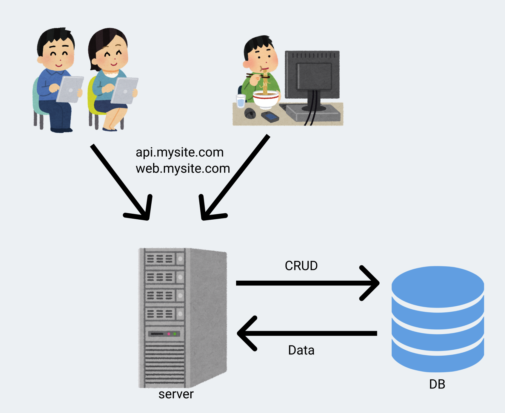
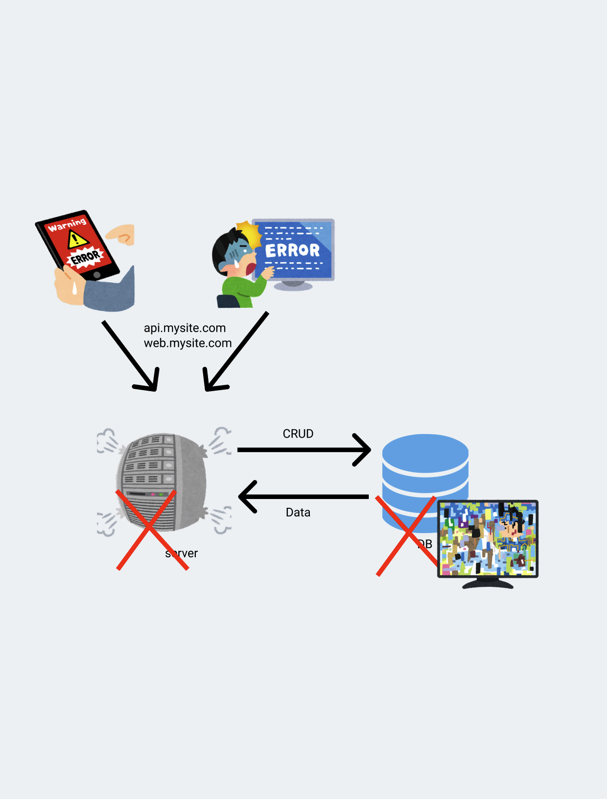
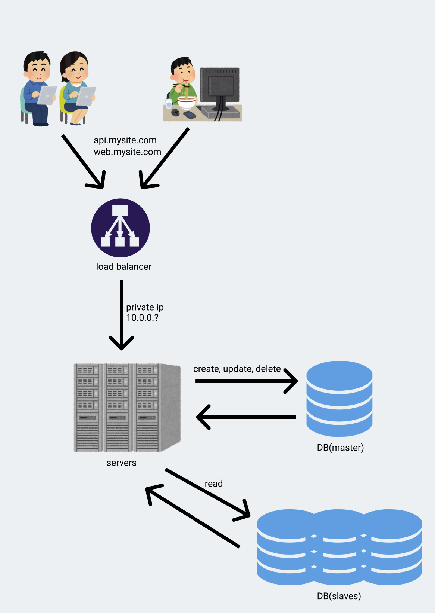

# 서론

폭발적으로 성장하는 서비스들은 그 성장세를 효과적으로 처리하기 위한 고민을 한다. 감사하게도 내가 있는 회사의 서비스도 굉장히 폭발적으로 성장하였다. 2020년 11월에 입사해서 어느덧 1년이 다 되어가는데, 그 사이에 매출이 거의 2.5배 정도로 뛰었다. 작년 11월에 입사했을 때도 거의 매일같이 순 거래액을 갱신할 정도로 크게 성장했는데, 그 이후에도 멈추지 않고 현재까지 달려왔다. '이 목표액 달성하면 전 직원 하와이 보내드리겠습니다' 하고 CEO가 얘기한 조금은 허황되어 보였던 금액도 지금이라면 진짜 달성할 것 같다고 생각할 정도로 많이 성장했다. 우리 메인 페이지의 트래픽도 많이 늘었듯이 내가 담당하는 백오피스 시스템의 시스템 메트릭들도 껑충껑충 뛰고 있다. 물론 메트릭이 뛰는 이유는 대체로 과거에 이 시스템이 개같이 만들어졌고 그것을 적절한 시기에 청산하지 못한 잘못이 제일 크지만, 이 서비스를 갈아엎고 새 서비스를 만드는게 기존 서비스를 수정하는 것과 비슷한 공수가 들 것이라 생각하면서 자연스럽게 대규모 시스템들은 어떻게 설계가 되는지 관심을 갖게 되었다. 그래서 최근에 몇 가지 도서와 여타의 자료들을 찾아보게 되었고, 그 과정에서의 나의 부족한 생각들을 기록으로 남기고자 글을 적는다. 

기본적이고 추상적인 개념들부터 그 개념들에 대한 나름 상세한 고찰(?)을 반복하는 식으로 글을 적게 될 것 같다. 오늘처럼 며칠 어치 작게 공부한 내용들을 모으면 이렇게 하나의 글을 적을 수 있게 된다. 그런 식으로 설계에 대해서만 한 달 정도에 거쳐 5개 내외의 글을 적게 될 것 같다. 오늘 적을 글은 시스템 설계시 고려되는 점들에 대해 적어볼 생각이다. 사진에 들어있는 그림들 중에서는 다른 아이콘들에 비해 귀여운 그림이 있는데 이 그림들은 전부 [이라스토야(irasutoya)](http://www.irasutoya.com/)에서 배포하는 그림들이다.

# 설계와 확장성

사실 확장성에 대해 얘기하려면 *어디에서부터* 확장되는지 먼저 얘기해야 한다. 그래서 가장 단순한 구조는 어떻냐는 얘기를 한다면, 물론 어떤 서비스를 만드느냐에 따라 설계에 대한 얘기는 모두 다르지만, 어떤 서비스든지 사용자에게 어떤 기능을 '보여줘야' 한다는 공통점이 있다. 그래서 필수적으로 웹(api) 서버와 그것을 보여주는 어떤 존재들(e.g. 웹페이지, 모바일 어플리케이션 등)이 필요하다. 이렇게 필수적인 존재들만 있다고 했을 때의 구조는 아래와 같다. 

그림의 구조는 서버 한 대가 서비스의 모든 기능을 제공하는 형태이다. (DNS같은 서비스는 생략) 사용자가 웹/모바일 어플리케이션 등의 어떤 인터페이스를 통해 서버에 요청을 하면 한 대의 서버가 모든 기능을 제공하는 형태이다. 가장 빠르게 만들 수 있고, 요즘 cpu나 클라우드 서비스의 가격을 생각하면 어지간한 트래픽은 저렴한 서버 한 대로도 수행할 수 있다. 

위와 같은 구조로 초기 서비스를 만들고 운영하다 보니 사용자가 점점 많아지면 언젠가 서버 한 대로는 트래픽을 안정적으로 수행하기 힘들 때가 온다. 이유는 여러가지가 될 수 있다. 단순하게 예상 가능한 이유 두 가지는 대략적으로 아래와 같다.

1. 순수하게 사용자가 늘어서 트래픽이 증가했고 서버의 자원이 부족해서 늘어난 트래픽을 처리하지 못 함
2. 서비스 규모가 커지면서 배포가 잦아졌는데 장비 외적인 이슈(인력부족 등)로 서비스의 안정성이 떨어지는 경우

만약 1번 케이스라면, 트래픽을 처리하기 위해 **_scale up_** 또는 **_scale out_** 을 고민할 것이다. **_Scale up_** 은 장비의 성능을 올려서 문제를 해결하는 방식이다. Scale up에는 장비의 성능이라는 분명한 한계가 존재하긴 하지만 아주 작은 서비스에서 시작했다면 보통 비용상의 문제로 scale up을 할 여지는 분명히 남아있을 것이고 그럼 하드웨어 성능을 개선하는 것으로 당면한 문제를 빠르게 해결할 수 있다. 반대로 **_Scale out_** 은 하나의 장비에서 하던 일을 여러 장비들이 처리할 수 있도록 확장하는 방식이다. 쉽게는 비슷한 수준의 서버를 몇 개 더 띄우고 그 서버들에 서비스를 그대로 배포해서 parellel하게 돌아가는 서비스들을 load balancer로 묶는 방식이다. 각각의 방식은 분명한 장단점이 존재한다. 
Scale up은 단순히 서버의 사양만 올리는 것이라서 인스턴스의 성능을 바꾸는 것을 제외하면 할 일이 없다. 네트워크 설정도 그대로고 서비스 배포도 똑같이 하면 되고 소프트웨어를 변경할 필요조차 없다. 소프트웨어의 측면에서는 기존과 완전히 똑같기 때문에 데이터의 정합성 이슈에서 굉장히 자유롭다. 그런데 언제까지나 서버의 성능을 올리는 것으로 문제를 해결할 수는 없다. Scale up은 성능이 올라갈수록 가성비가 떨어진다. 그리고 명확한 한계가 존재한다. 언젠가는 너무 비싼 장비를 사야 하거나, 그마저도 못하기 때문이다. 보통 클라우드 환경에서 운영하는 사람들은 인스턴스를 빠르게 띄우고 내릴 수 있는 환경의 특성 때문에 단일 서버로 돌아가는 서비스를 운영하는 케이스가 잘 없다. 

첫 회사는 이미 IDC에 입주해 있었고 AWS를 너무나 싫어했던 나머지 실물서버를 지속적으로 관리하는 방식으로 운영해 왔었다. 이런 환경이라면 스케일업을 할 때는 또 다른 이슈가 생기는데, 바로 공간과 전력 그리고 냉각의 문제이다. 사실 IDC에 입주했다는 시점에서 전력과 냉각 문제는 없을 것 같은데(IDC에서 냉각 이슈가 있으면 그냥 같은 공간을 쓰는 장비들이 전부 다운되는 것 아닌지...) **공간**이 제일 문제이다. 만약 서버의 디스크로 HDD를 사용한다고 가정해보자. (물론 아직까지도 HDD가 달린 서버를 관리하러 IDC에 들어가는 회사라면 즉시 탈주해야 한다) 용량이 부족해서 scale up을 하러 IDC를 방문해서 랙을 봤는데 랙에 공간이 없거나 보드에 SATA포트가 부족하면 어떻게 할 것인가? SATA포트가 없다면 정말 어거지로 외장하드라도 붙일 수 있는데 공간이 부족하면 답이 없다. HDD를 공간 대비 용량이 높은 SSD로 교체하거나 서버를 늘려야 한다.  다른 부속들도 마찬가지다. 이런 공간적인 한계에 미치면 무조건 장비를 바꾸게 된다. (왜 이렇게 길게 적었나 생각해보니 전 회사가 정말 쓰레기같은 서버를 쓰고 있어서 항상 욕을 했었고 이게 결국 트래픽을 못 버티니 새 장비를 구매했는데 어떻게든 싸게 사려고 중고를 샀었고 그 중고 서버의 성능이 정말 처참해서 이럴거면 AWS라도 쓰라고 했던 기억이 있다.)

Scale out은 서버의 갯수를 늘리는 것을 지칭하는 말이다. 특히 클라우드 환경에서는 새로운 인스턴스를 띄우고 내리는 것이 매우 빠르기 떄문에 서버의 성능 확장을 수평적으로 하는 것이 서비스의 운영에 굉장히 유리한 것으로 보인다. 또한 정말 고성능의 서버를 하나 운영하는 것 보다 저성능의 서버를 여러대 운영하는 것이 가성비가 더 높을수도 있다. 자체적으로 서버실을 가지고 있거나 IDC에 입주했다면 공간적인 문제 때문에 이런 선택을 하기 어려울 수 있지만 클라우드는 얘기가 다르다. 그리고 성능적인 한계가 없다. 새로운 서버를 올릴 여건만 충분하다면 성능적인 측면은 걱정할 일이 없다. 이러한 구조는 굉장히 유연하고 빠르다. 한번에 단일 서버로 트래픽이 몰리는 경우 필연적으로 병목현상이 생길 수 밖에 없는데, 서버를 유연하게 띄울 수만 있다면(autoscaling) 이러한 걱정을 할 일이 없다. 그렇지만 강한 힘에는 강한 책임이 따르는데, 서비스를 수평적으로 운영하기 위해서는 신경써야 할 이슈들이 많다. 여러대의 서버에서 작업을 나누기 때문에 데이터의 정합성 이슈가 있다. 만약 서버에 저장되는 데이터가 있다면 그 데이터를 어떤식으로 공유할 것인지에 대한 기술적인 해결이 필요하다. (e.g. session) 

이제 기존 설계의 문제점을 다시 생각해보자. 사진의 설계에서는 서버도 하나고 DB도 하나이다. 서버 하나에 트래픽이 몰리면 서비스가 무조건 지연되고, 그 서버가 죽으면 모든 유저가 서비스를 사용할 수 없는 대형 장애가 발생한다. DB도 마찬가지다. DB의 리소스가 부족하면 서버가 살아있고 멀쩡한 상태여도 병목이 서비스에 영향을 끼치게 되며, 혹여나 DB 서버에 문제가 생겨서 데이터가 날아간다면 미리 백업을 해두지 않는 이상 복구할 방법이 존재하지 않는다. 현재의 설계에서는 서버와 DB 모두가 [SPOF(single point of failure)](https://ko.wikipedia.org/wiki/%EB%8B%A8%EC%9D%BC_%EC%9E%A5%EC%95%A0%EC%A0%90)이다. 그래서 SPOF를 만들지 않기 위해서는 하나의 서버가 다운되기까지해도 전체 서비스에 영향을 끼치지 않는 환경을 만들어야 하기 때문에 어차피 서버의 갯수를 늘려야만 한다. 서버는 그냥 서버를 늘려서 서비스를 똑같이 띄우면 되는데 DB는 어떻게 처리할까? 물론 정말 고성능 DB를 써서 모든 데이터에 대한 관리를 하나의 DB에서 처리해도 된다. 하지만 보통 DB의 데이터는 매우 중요하기 때문에 replication하고, 이를 master-slave라 부르며 관리한다. 원본DB에서는 주로 CUD 요청을 날리고 read는 slave에 요청 하도록 분리할 수 있다. 여기까지 하면 SPOF는 없어진다. 서버도 병렬적으로 여러개이기 때문에 한 서버가 죽더라도 서비스 전체에 영향을 끼치지는 않을 것이며, DB도 모든 DB가 동시에 죽는게 아니라면 master가 죽더라도 slave들 중 하나를 master로 선정해서 다시 운영될 것이고 덕분에 DB장애도 전체 서비스에 영향을 끼치지는 않을 것이다. 

그림만 봐도 뭔가가 늘어났다. 몇 년 안되지만 지금까지 일해온 바로는 이렇게 뭔가가 늘어날 수록 더 민감하게 관리해야 한다. (단순하면 민감하지 않아도 된다는 것은 아니다.) 최초의 설계와 비교했을 때 지금 설계를 운영하기 위해서는 일단 서비스(소프트웨어)가 서로에게 영향을 줄 필요가 없도록 잘 구현되어 있어야 한다. 대충 만들어도 된다고 해서 정말 너무 대충 만들어서 웹 서버와 정기적으로 도는 job들이 다 같은 프로세스로 뜨는 것들이 있다. 이런 서비스는 병렬적으로 돌기 어렵다. 두 인스턴스가 같은 시간에 배포된다면 job들이 같은 시간에 동시에 n번 돌 것이기 때문이다. 이런 케이스라면 일단 웹 서버와 job을 먼저 분리해 내야 한다. 그런데 이제 DB에 무슨 작업을 하는 job들이 돌고 있다면 같은 소스 내에 정의된 DAO들에 의존하고 있을 것이다. ORM으로 DB를 물려서 DB의 데이터를 entity class로 가져오고 어떤 연산을 해서 그 entity들의 값을 바꾼 뒤 다시 update 치는 소스코드들은 언제나 본다. 그렇다면 job을 분리해 내기 위해서는 새 프로젝트에 ORM 세팅과 Entity 정의들을 똑같이 새로 만들어야 한다. 이런식으로 서비스가 분리될 때 마다 매번 entity들을 똑같이 적고 있을 수 없으니 이제 데이터에 접근할 용도의 서비스를 분리하기 시작할 것이다. 이런식으로 나가면 할 일이 정말 많아지는데, 이렇게 [어플리케이션을 상호 독립적인 최소 구성 요소로 분할하는](https://www.redhat.com/ko/topics/microservices) 설계를 보고 우리는 **마이크로서비스** 라고 부른다.

물론 자세히 따지면 load balancing이라는게 무엇인지 이해할 필요도 존재한다. 하지만 어지간한 규모에서는 load balancing에 대해서는 자세히 생각할 필요가 없다. 클라우드 환경이라면 AWS ELB, 아니면 보통 nginx 같은 L7 switch들을 사용하는데, 이런 load balancer들은 application layer에서 load balancing을 수행하기 때문에 패킷을 가지고 트래픽을 분산할 수 있다. 가장 대표적인 예시로, 서비스를 운영하다 보면 그냥 무작위로 도메인이나 아이피를 돌면서 포트가 열려있는지 확인하고 열려있으면 때려보는 중국인 친구들을 방어해야 할 일이 종종 있는데 nginx 하나 붙여놓으면 든든하다. 그래서 load balancer에 대해서는 나도 아직 잘은 모르고, 이 글에서는 나올 일 없을 것이다. 

이번 글에서는 보통 학부생들이 수업 들으면서 띄워보는 웹 서버의 구조를 한 번 그려봤고 그것을 단순하게는 어떻게 개선할 수 있을지 살펴보았다. 다음 글에서는 아마 네트워크나 캐시, CDN 등의 얘기를 할 것 같다. 